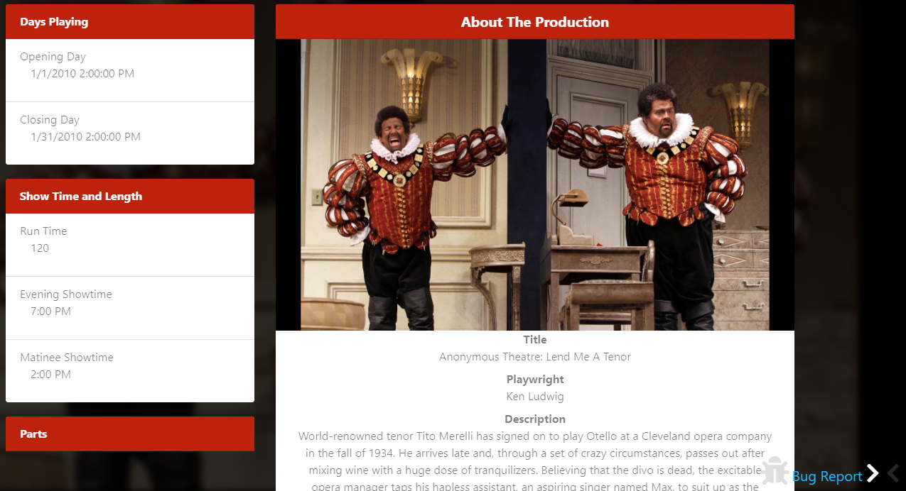
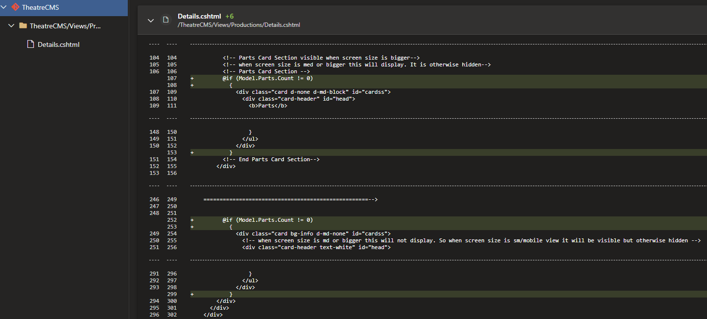
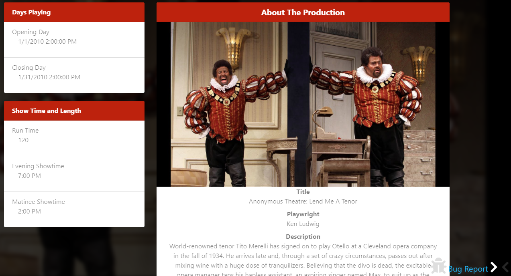
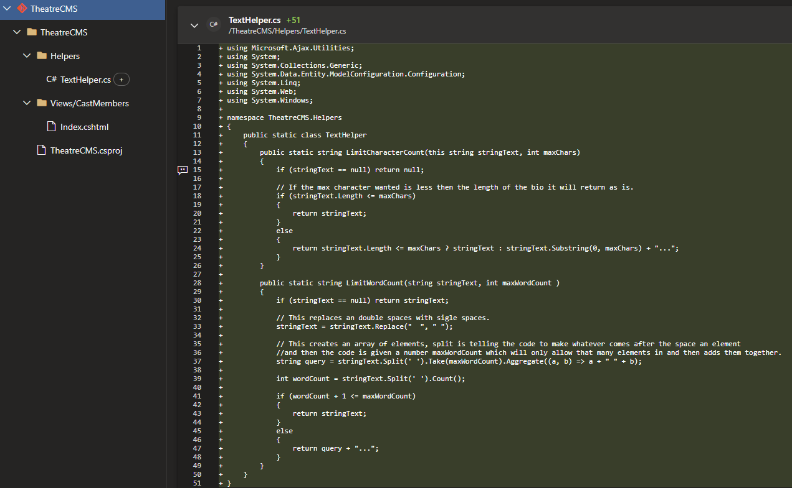
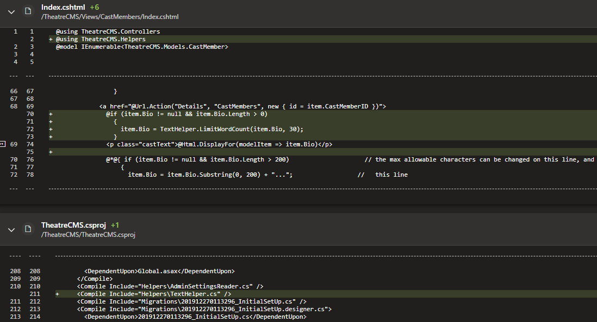
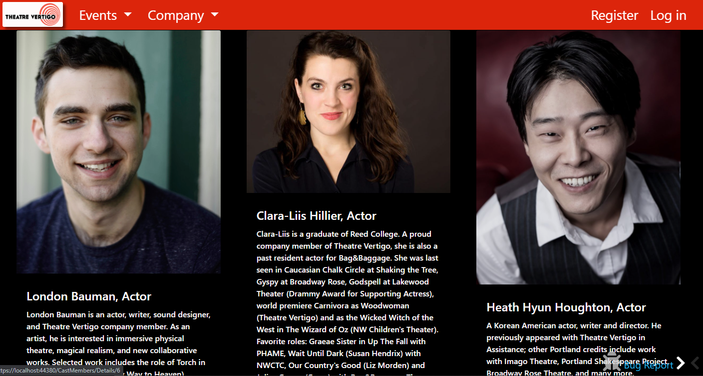
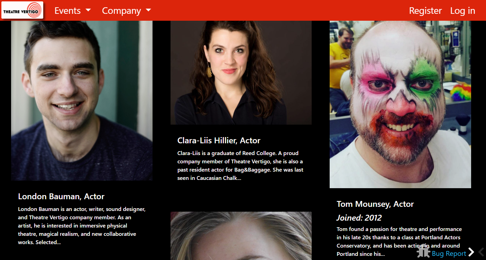
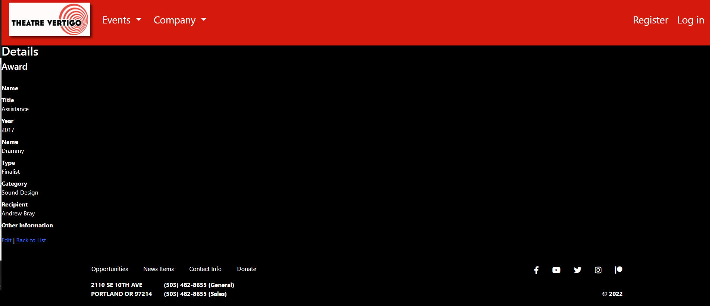
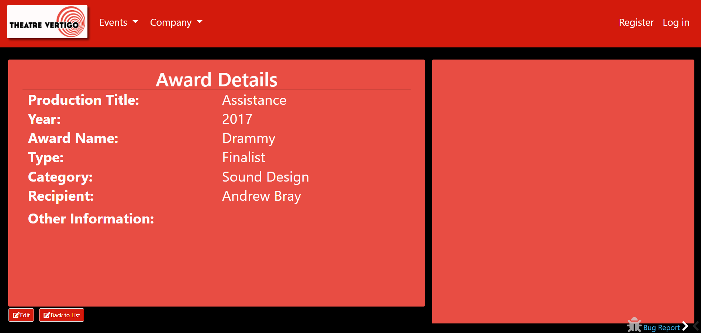

<h1 id="Top">Prosper IT Consulting Internship</h1>
 
<h2>Introduction</h2>

  A two weeks sprint using Agile/Scrum methodology, with daily stand ups and weekly retrospectives. The project itself was a Theatre site that had already been scaffolded with     the MVC Framework, and my team was concentrating on the UX component. My tasks revolved around HTML5, CSS3 and C# Code. Tasks like removing unnecessary headers, to restricting   word or character count on certain pages and more will be described in greater detail below. 
 

 
 <h2>Stories<h2>
  <ul>
    <li>
      <a href="#PartHeader">Part Header</a>
    </li>
    <li>
      <a href="#MaxWordCount">Max Word Count</a>
    </li>
    <li>
      <a href="#UpdateAwardPage">Update Award Details Page</a>
    </li>
  </ul>
  
  
  <h3 id="PartHeader">Part Header</h3>
  

    The first task I chose to start working on, asked me to remove an element from appearing if the element had no value, and asked that I do so only using Razor syntax. Which I     know I could do. As you can see the Part header on the bottom left is there even though there are no parts associated with it.
  

  <b>BEFORE</b>

  

    This was the elegant solution that I created and applied.
  

    Now the part header is no longer there if there are no parts entered into the production details.
  

  <b>AFTER</b>

 
<h3 id="MaxWordCount">Ellipses and Max Word Count</h3>

  This next task was working more with a back end element, were I needed to create a class to assist the user with entering and viewing a limit on textual information.

  They requested that I only apply one of the methods that I made, so that’s exactly what I did. I found the corresponding page they wanted me to apply the LimitWordCount method   to and add an if statement with it and worked exactly as planned.

 
<b>BEFORE</b>

<b>AFTER</b>

 
<h3 id="UpdateAwardPage">Update Award Details Page</h3>

  The last task I picked up was a complete overhaul of the Award details page. This time the requirements were to imitate a picture they provided me. I put in two separate columns, making the left column bigger as requested, rewording, resizing, spacing and boldening text as well as making the edit and back to list links into buttons that were consistent with the rest of the site. Do to time restraints I was unable to add an if statement not allowing titles with no value to appear as well as finish the vertical resizing the columns, linking an image corresponding with the recipients name to the right column, making a more information button and three check boxes describing which part of the production they were associated with Actor, Director or Back stage crew also in the right column. 

<b>BEFORE</b>

<b>AFTER</b>

 
<h2>Thoughts/Considerations</h2>

  I enjoyed my internship at Prosper IT Consulting, here are some of my personal favorite moments. The daily Stand-ups were in my opinion were a great way to start each work       day, hearing the teams progress, and knowing if I, or anyone else needed help it was available. Overcoming a roadblock, I had in my second task with some advice from my         project manager, made me feel like I could rely on my team which is a great feeling to have. Whenever I created a pull request for my task, and it got accepted to merge into     the master branch, I always felt a sense of pride and satisfaction, every time.
   
   
  After each task I tried to reflect on what I did poorly so I could improve upon it for future task. Each task I had something needing to be worked on. My first task, I           overcomplicate a simple if statement and was pulling from the wrong element value, when I took a step back and started debugging the code is when I realized how simple it all   was. The second task I did not overthink. My main problem with the second task was waiting too long to reach out for help. If I reached out earlier, I could have finished the   third task I picked up. Always reflecting on what I did right and wrong will help me in future projects.

<i><a href="#Top">Back To Top</a></i>
